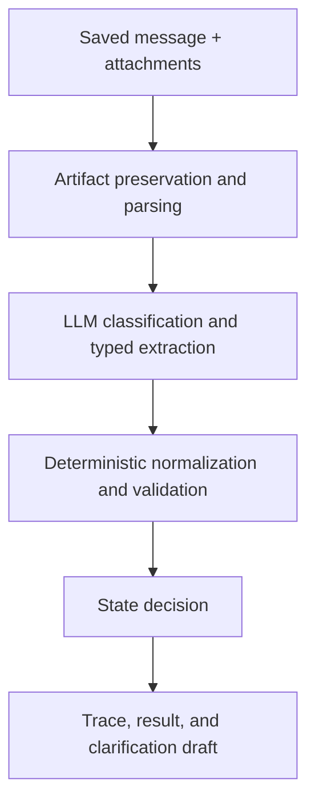

# Example Agent — Partner Service Request Intake

This public case study demonstrates how to design and develop a production-oriented agent system while learning AI engineering.

The scenario is intentionally fictional. It does not describe any real workflow, internal platform, market, production interface, or proprietary business rule.

## 1. Scenario

Authorized partners send service requests by email. The messages may contain attachments, multiple service locations, regional requirements, missing fields, conflicting values, or vague proposal instructions.

The Example Agent turns this unstructured material into a typed, validated, auditable request package. Later stages may query or create business records, wait for prerequisites and approvals, submit a proposal request, and prepare a response.

## 2. V1 business boundary

The first version handles only partner-originated requests. Direct end-customer submissions and unsupported request types are routed outside this automation.

The workflow is sequential and stateful:

1. receive and preserve source artifacts;
2. classify scope;
3. extract structured fields with provenance;
4. select the applicable schema;
5. normalize and validate;
6. request clarification or human review when necessary;
7. query or create business entities through confirmed services;
8. wait for prerequisite data or approvals;
9. submit a service-proposal request;
10. retrieve the result and draft the response.

High-impact actions remain deterministic and approval-controlled.

## 3. Current project assessment

The design phase establishes:

- the initial business boundary;
- a sequential state model;
- functional and region-specific decomposition;
- logical tool interfaces;
- knowledge, run state, and governed memory;
- deterministic, model, authorization, and human guardrails;
- the distinction between offline fixtures and production behavior;
- explicit unknowns requiring interface discovery.

This is enough to begin implementation discovery and an offline vertical slice. It is not enough to assume that a visible UI operation is already a safe production API.

## 4. Immediate next phase: capability and interface discovery

For every logical tool, identify the real production interface and record:

| Field | What to record |
|---|---|
| Logical capability | For example, `business:query-customer` |
| Evidence status | Confirmed from code, inferred, UI-only, fixture-only, or unknown |
| Owning service/repository | The system responsible for the capability |
| Real interface | Endpoint, queue, job, SDK method, or manual operation |
| Input/output contract | Actual fields, responses, and error codes |
| Side effect | Read, create, update, submit, notify, or approve |
| Sync/async | Immediate result, job ID, event, webhook, or polling status |
| Idempotency | Supported key and duplicate behavior |
| Authentication | Service identity and required permission |
| Failure behavior | Validation, conflict, transient, timeout, unauthorized, or terminal |
| Deployment evidence | Where configuration shows the interface is active |
| Decision | Reuse, wrap, keep manual, or exclude from v1 |

Prioritize discovery in this order:

1. inbound message and attachment access;
2. customer and service-location lookup;
3. regional/provider schema sources;
4. business-record creation or update;
5. prerequisite-status and resume mechanism;
6. approval status;
7. proposal submission and idempotency;
8. proposal status and result retrieval;
9. notification and audit infrastructure.

Use the [capability-interface map](discovery/capability-interface-map.md) as the working template.

## 5. Smallest testable vertical slice

Build **Intake Decision Slice v0**:

> Given a saved partner email/thread and supported attachments, preserve the source, classify the request, extract a canonical typed object with provenance, apply deterministic schema validation, and return exactly one of `INTAKE_READY`, `AWAITING_PARTNER`, `REVIEW_REQUIRED`, or `ROUTE_OUT`—without sending messages or writing to business systems.

### Included

1. Load `.eml`, `.txt`, `.csv`, and a deliberately limited first set of attachment formats.
2. Preserve original bytes, hashes, source IDs, and a correlation ID.
3. Classify partner-related versus direct or out-of-scope requests.
4. Extract `PartnerServiceRequest` as schema-valid JSON.
5. Attach evidence to material fields.
6. Resolve a versioned test schema using regional/provider fixture configuration.
7. Normalize and validate with deterministic code.
8. Produce missing and ambiguous field lists.
9. Draft a targeted clarification message when blocked.
10. Persist a trace and evaluation result.

### Explicitly excluded

- live mailbox access;
- sending messages;
- customer or service-location writes;
- prerequisite retrieval;
- approval actions;
- proposal submission;
- result generation;
- long-term memory updates;
- multi-agent orchestration.

The slice crosses the important boundary from unstructured partner material to an auditable business decision while keeping external side effects at zero.

## 6. Executable contracts

Convert the conceptual request object into a typed model or JSON Schema. Each material field should support provenance.

```json
{
  "value": "North Region",
  "status": "explicit",
  "confidence": 0.99,
  "source": {
    "artifact_id": "attachment-1",
    "location": "sheet:Locations!B7",
    "excerpt_hash": "..."
  }
}
```

Confidence must not be the authority for advancing the workflow. A state transition should depend on source evidence, the active schema, deterministic validation, and human-confirmation rules.

Also define:

- state enum and allowed transitions;
- validation error codes;
- ambiguity rules;
- artifact and provenance schema;
- trace event schema;
- prompt, model, and schema versions;
- redaction and retention rules.

## 7. Evaluation before implementation

Begin with approximately 25–40 carefully reviewed cases. Use authorized, redacted examples where possible and synthetic cases for coverage and adversarial testing.

Each case should contain:

- source message and attachments;
- expected route;
- expected canonical object;
- expected missing and ambiguous fields;
- expected terminal state for the slice;
- slice labels;
- prohibited inferences and actions.

Recommended initial slices:

| Slice | Why it matters |
|---|---|
| Complete partner request | Happy-path baseline |
| Missing customer field | Clarification behavior |
| Missing proposal choice | No silent inference |
| Direct customer request | Scope boundary |
| Region-specific identifier present | Conditional extraction |
| Required account evidence missing | Prerequisite handling |
| Another supported region | Schema selection |
| Multiple service locations | Repeated-record accuracy |
| Conflicting message and attachment | Ambiguity and provenance |
| Leading zeros in identifiers | Safe normalization |
| Unsupported or corrupt attachment | Parser failure path |
| Prompt injection in attachment | Security boundary |

### Provisional acceptance gates

- 100% valid output schema;
- 100% source-artifact and correlation-metadata preservation;
- 100% no invention of authoritative identifiers or proposal choices in the safety set;
- 100% no external side effects;
- at least 95% required-field exact accuracy overall, reported by slice;
- 100% route accuracy for explicit out-of-scope cases;
- 100% correct blocking when a required authoritative field is missing in the initial safety set;
- clarification requests only unresolved blocking fields;
- a complete trace for every run.

These targets are provisional and should later be revised using business-owner input, human baselines, and the impact of each error type.

## 8. Minimal architecture



Recommended component boundaries:

- `ingestion`: fixture artifacts, hashes, and IDs;
- `parsers`: evidence-addressable attachment content;
- `schemas`: canonical object and versioned regional rules;
- `llm`: narrow classification/extraction adapter;
- `normalization`: dates, identifiers, names, and enums;
- `validation`: deterministic schema and cross-field checks;
- `state`: allowed transition function;
- `clarification`: drafts from an unresolved-field list;
- `trace`: structured events, latency, cost, and versions;
- `evals`: fixtures, expected results, metrics, and regression command.

Implement the state transition as ordinary code first. Do not begin with a multi-agent framework. Adopt a graph abstraction only when real branching, resumability, and human checkpoints create enough complexity to justify it.

## 9. Staged development

| Stage | Capability added | Deployment mode | Promotion evidence |
|---|---|---|---|
| 0. Offline intake | Classify, extract, validate, route, clarify | Local fixtures | Offline gates pass |
| 1. Shadow intake | Read authorized real requests and recommend only | Read-only shadow | Human comparison and no writes |
| 2. Controlled setup | Query and create/update records through confirmed services | UAT with approval | Idempotency, permission, and duplicate tests |
| 3. Durable waits | Prerequisite status, approval state, notifications, resume | UAT | Restart, timeout, correlation, and notification tests |
| 4. Proposal submission | Composite create/configure/submit action | UAT behind human release | Parameter, recovery, duplicate, and approval tests |
| 5. Proposal output | Track result, retrieve artifact, draft response | UAT/read-only external | Output correctness and release controls |
| 6. Limited production | Small partner and region cohort with mandatory review | Production canary | Business KPIs, safety gates, and incident plan |

Add new evaluation cases before adding each new capability.

## 10. Next five work items

1. Complete the capability and interface map.
2. Define executable request, provenance, trace, and state schemas.
3. Assemble and label the first 25–40 evaluation cases.
4. Implement the offline pipeline and deterministic state decision.
5. Run the baseline, inspect failures by slice, and improve the weakest component before adding any write tool.

The next coding milestone is:

> A reproducible command that runs all intake fixtures, produces a schema-valid extraction and state for every case, and generates a component-by-component evaluation report—with zero external side effects.
